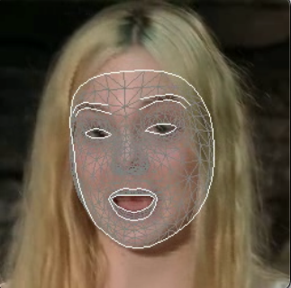
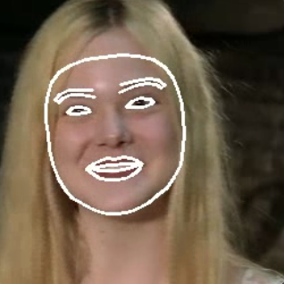
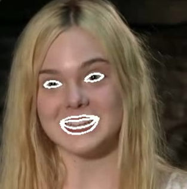

# MediaPipe Face Landmarks Dataset Builder

This repository provides tools to process videos and build face landmark datasets using MediaPipe. It includes functionalities such as downloading raw videos, slicing video segments with face detection, cropping face regions, and drawing facial landmarks in multiple styles.

---

## Table of Contents

- [Features](#features)
- [Environment Setup](#environment-setup)
- [How to Use](#how-to-use)
  - [1. Downloading Videos](#1-downloading-videos)
  - [2. Slicing Videos](#2-slicing-videos)
  - [3. Cropping Face Regions](#3-cropping-face-regions)
  - [4. Drawing Facial Landmarks](#4-drawing-facial-landmarks)
- [Output Examples](#output-examples)
- [Dependencies](#dependencies)

---

## Features

1. **Video Download**: Download raw video data from YouTube using video IDs provided in a CSV file.
2. **Video Slicing**: Extract specific video segments where faces appear for a minimum duration.
3. **Face Cropping**: Crop face regions from videos with smoothing and fixed face regions.
4. **Face Landmark Drawing**: Draw facial landmarks on videos in multiple formats.

---

## Environment Setup

### Create Conda Environment

Use the **`environment.yml`** file to set up the Conda environment:

```bash
conda env create -f environment.yml
conda activate mediapipe-face-landmarks
```

### Verify Installation

Ensure that **FFmpeg** and **yt-dlp** are correctly installed:

```bash
ffmpeg -version
yt-dlp --version
```

Make sure that FFmpeg installed in the Conda environment is being used. Conflicts may arise if another version is accessed. 
```bash
which ffmpeg
```
---

## How to Use

### 1. Downloading Videos

Download videos using a CSV file containing YouTube video IDs:

```bash
python download.py -i metadata.csv -o source_videos
```

- **Input**: `metadata.csv` (a CSV file with a `video_id` column)
- **Output**: Downloaded videos saved to the `source_videos` directory (default).

### 2. Slicing Videos

Extract video segments where faces are detected for a minimum duration:

```bash
python slicer.py -i "source_videos/video.mp4" -o slice_result -d 3
```

- **Input**: Video file (e.g., `/source_videos/video.mp4`)
- **Output**: Sliced segments saved in the `slice_result` directory.
- **Options**:
  - `-d` or `--duration`: Minimum face duration in seconds (default: 3).

### 3. Cropping Face Regions

Crop face regions from videos and retain audio:

```bash
python crop.py -i "slice_result/video_segment_1.mp4" -o crop_result
```

- **Input**: Sliced video segments.
- **Output**: Cropped face video with original audio saved to `crop_result`.

### 4. Drawing Facial Landmarks

Draw face landmarks in different styles. Choose from **4 options**:

```bash
python video_landmark.py -i "crop_result/video.mp4" -o landmark_result -v 1
```

- **Options**:
  - `-v 1`: Draw TESSELATION + CONTOURS (default).
  - `-v 2`: Draw CONTOURS only.
  - `-v 3`: Draw eyes and lips without FACE_OVAL.
  - `-v 4`: Draw eyes and lips only on a black background.
- **Output**: Processed videos saved to `landmark_result`.

---

## Output Examples

| Option 1 (`-v 1`)           | Option 2 (`-v 2`)           | Option 3 (`-v 3`)           | Option 4 (`-v 4`)           |
|-----------------------------|-----------------------------|-----------------------------|-----------------------------|
|   |   |   |   |

---

## Dependencies

- Python 3.10
- MediaPipe
- OpenCV
- FFmpeg
- yt-dlp